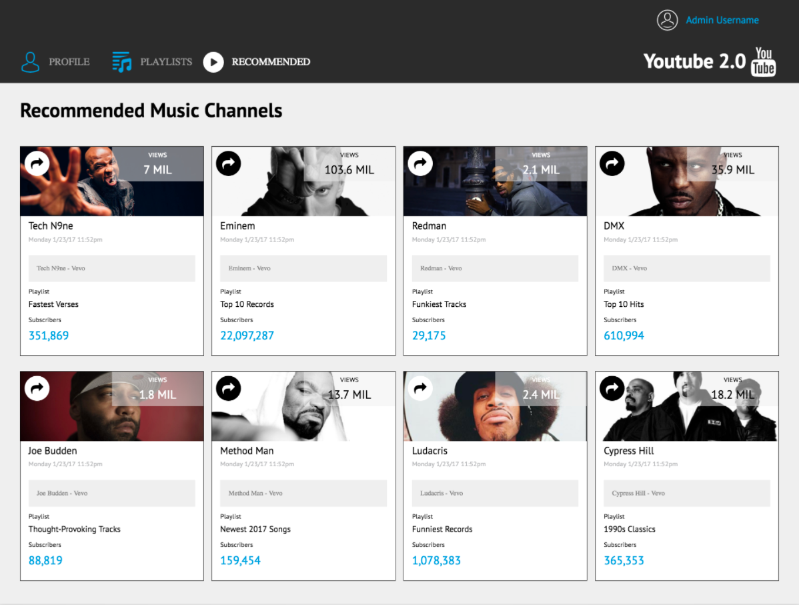

## Synopsis

This project is my second static webpage for a media website like YouTube.  The application was developed in order to further practice Flexbox, design, and responsiveness.  This project was developed for a class at the Turing School of Software and Design.

## History

* Included compatibility for mobile devices
* Made application responsive to multiple screen sizes
* Stylized elements using CSS and Flexbox
* Added content including links to separate pages when buttons are clicked
* Added svg icons and images
* Created structure and buttons with HTML

## Built With

* [HTML](https://github.com/wheresmytyphone/linked-list/blob/master/index.html) - The structure of the page
* [CSS](https://github.com/wheresmytyphone/linked-list/blob/master/styles.css) - The look and colors of the page & buttons

## Contributors

Travis Rollins  
